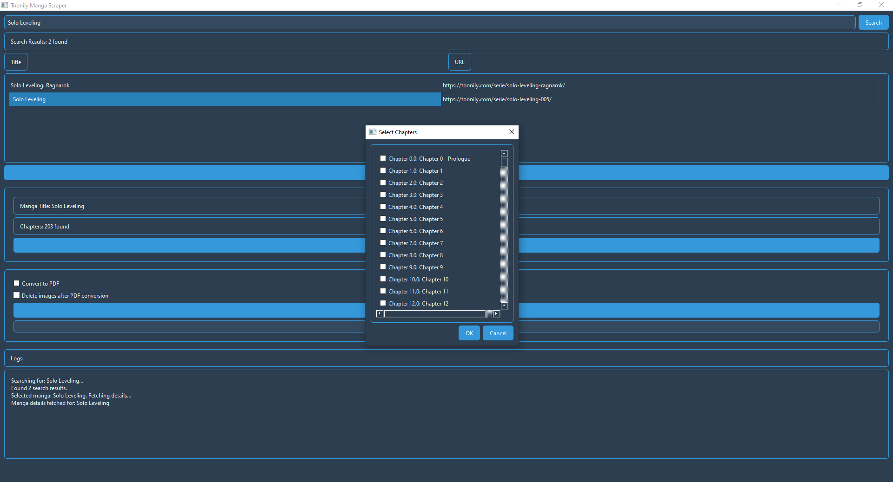

# 📘 Manga Scraper - Toonily Downloader

> ⚔️ Your Ultimate Manga Companion  
> 🚀 A practical tool for downloading manga from Toonily.com. Downloads entire series, preserves image quality, and organizes chapters automatically.

---

## 🌟 Overview

This Python tool helps manga fans download and organize their favorite series from Toonily. It offers:

- Both command-line and graphical interfaces
- Chapter selection with progress tracking
- Automatic PDF conversion options
- Error recovery for interrupted downloads
---

## ✨ Key Features

### CLI Features
*   **Download Manga by URL**: Fetches all chapters of a manga from a given Toonily URL.
*   **Save Images in Original Format**: Downloads and saves images in their original format (e.g., `.webp`, `.jpg`, `.png`) without re-encoding, preserving the original quality.
*   **Concurrent Downloads**: Utilizes multiple threads to download images concurrently, significantly speeding up the process.
*   **Custom Download Location**: Allows users to specify a custom directory for saving downloaded manga.
*   **Chapter-Based Organization**: Organizes downloaded images into separate folders for each chapter.
*   **Robust Error Handling**: Includes error handling to manage failed downloads and other potential issues gracefully.
*   **Logging**: Provides informative logs for successful downloads, errors, and general progress.
*   **PDF Conversion**: Converts downloaded chapters into high-quality PDF files without losing image quality.
*   **Configurable Download Threads**: Allows users to specify the number of concurrent download threads for faster downloads.
*   **Delete Images After PDF Conversion**: Provides an option to delete the original image files after converting a chapter to PDF.
*   **Parallel Chapter Downloading**: Downloads multiple chapters concurrently to significantly reduce the total download time.

### GUI Features
*   **Modern, Dark-Themed UI**: A visually appealing and easy-to-use interface with a dark navy blue theme.
*   **Manga Search**: Search for manga by title or directly by URL.
*   **Chapter Selection Dialog**: A pop-out dialog for easy selection of chapters to download.
*   **Background Downloading**: Download chapters in the background without freezing the user interface.
*   **Progress Bar**: Monitor the progress of downloads in real-time.
*   **PDF Conversion**: Convert downloaded chapters to high-quality PDF files.
*   **Image Deletion**: Option to delete the original image files after converting a chapter to PDF.
*   **Real-time Logging**: View logs of the scraping and downloading process in a dedicated log area.

## ⚡ Tech Stack

-   **Python 3.10+**
-   `requests`, `beautifulsoup4`, `aiohttp` (for async)
-   `rich`, `typer` (for beautiful, animated CLI experience)
-   `cloudscraper`, (Anti Bot Measures)
-   `Pillow`, (For Pdf Conversion)
-   `PyQt6` (for GUI)

---

## 🚀 Getting Started

### Installation

1.  **Clone the repository:**
    ```bash
    git clone https://github.com/Yui007/toonily_downloader.git
    cd toonily_downloader
    ```
2.  **Install dependencies:**
    ```bash
    pip install -r requirements.txt
    ```

### Running the Application

The `main.py` script serves as the entry point for both CLI and GUI modes.

#### CLI Usage

To use the interactive CLI mode:
```bash
python main.py
```
For detailed CLI commands and arguments, refer to [CLI_usage.md](CLI_usage.md).

#### GUI Usage

To launch the graphical user interface:
```bash
python main.py
```
Then, select option `2` for GUI Mode when prompted.

Here's a preview of the GUI:



For detailed instructions on using the GUI, refer to [GUI_usage.md](GUI_usage.md).

---


## 🤝 Contributions

If you'd like to contribute or extend this tool:
-   Fork the repo
-   Use the modular system to edit only necessary parts
-   Follow the naming and logging conventions

---

## 📄 License

MIT License. Free to use, share, and modify with credit.
